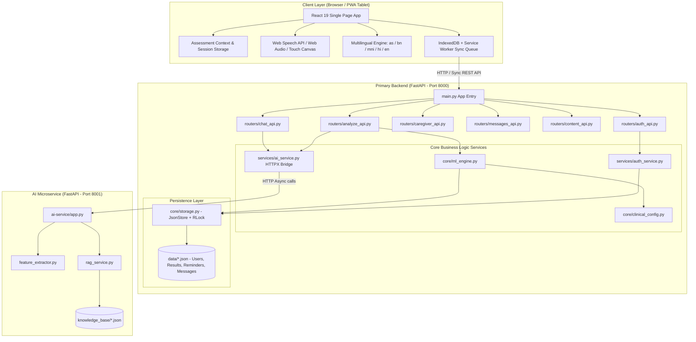
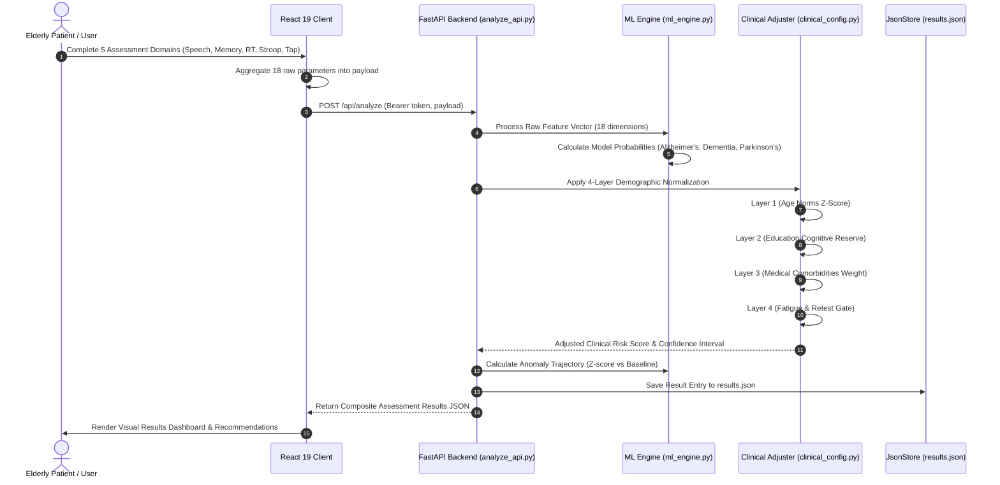
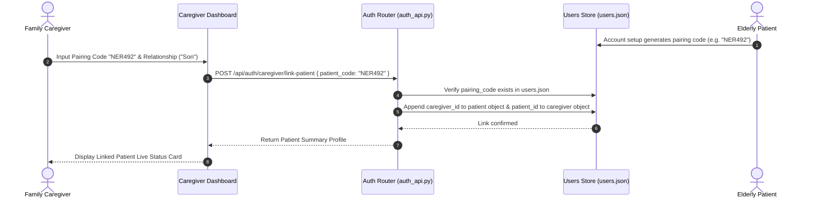
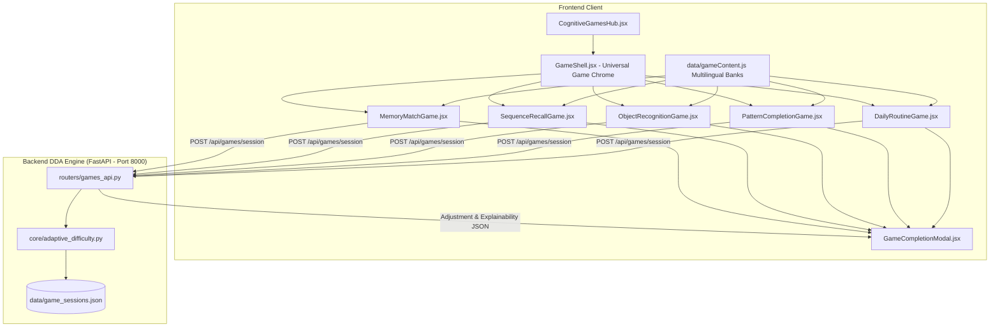

# NeuroAid V4 — Technical Architecture & System Design

> **Document Version:** 4.0.0  
> **Target Alignment:** Smart India Hackathon (SIH PS 26003)  
> **Architecture Pattern:** Multi-Tier SPA + FastAPI Microservices + Offline-First Sync Layer  

---

## 1. High-Level System Architecture

NeuroAid is built as a decoupled, multi-tier web platform composed of a modern React 19 client application, a primary FastAPI backend server for session management and clinical business logic, a dedicated AI/ML microservice for heavy analytics and RAG knowledge operations, and an atomic JSON persistence layer.



---

## 2. Component Architecture

### 2.1 Frontend Framework & Infrastructure (`frontend/`)
- **Core Technology:** React 19.2.0 bundled with Vite 7.3.1.
- **Routing Engine:** Light-weight state-driven SPA routing (`App.jsx`). Navigates between views based on top-level state (`view`, `role`, `page`) avoiding external router overhead for instant state transitions.
- **State Management:**
  - `AssessmentContext.jsx`: Holds live trial parameters across all 5 screening domains (`speechData`, `memoryData`, `reactionData`, `stroopData`, `tapData`).
  - `sessionStorage`: Client-side token storage (`neuroaid_token`) and user object cache (`neuroaid_user`).
  - `IndexedDB`: Client-side persistent cache storing offline game sessions, medication logs, and pending sync actions when disconnected.
- **Styling & UI Tokens:**
  - Tailwind CSS 3.4.19 + custom CSS token module (`frontend/src/utils/theme.js` & `index.css`).
  - **Glassmorphism Design Tokens:** Backdrop filters (`blur(28px) saturate(160%)`), translucent borders (`rgba(255,255,255,0.14)`), ambient neural background gradients.
- **Browser API Integrations:**
  - `window.SpeechRecognition`: Real-time speech-to-text transcription.
  - `AudioContext` & `AnalyserNode`: High-frequency audio energy sampling and pause ratio detection.
  - `Touch / Mouse Event Listeners`: High-precision microsecond tap interval timing.

### 2.2 Primary Backend Server (`backend/`)
- **Framework:** FastAPI (`fastapi>=0.111.0`) running on Uvicorn ASGI server.
- **Validation:** Pydantic v2 schemas (`backend/models/schemas.py`).
- **Router Modules:**
  - `auth_api.py`: Identity management, PBKDF2 hashing, multi-role register/login, doctor/caregiver linking.
  - `analyze_api.py`: Cognitive trial payload ingestion, 18-feature extraction, clinical adjustment pipeline execution, longitudinal trajectory updates.
  - `caregiver_api.py`: Caregiver dashboard data retrieval, emergency alerts, patient pairing codes.
  - `messages_api.py`: Secure threaded patient-doctor messaging with unread tracking.
  - `content_api.py`: Clinician passage and memory wordset creation/deletion.
  - `chat_api.py`: Safety-filtered proxy to the standalone AI RAG service.

### 2.3 Standalone AI Microservice (`ai-service/`)
- **Framework:** FastAPI running on Port 8001.
- **RAG Engine (`rag_service.py`):** TF-IDF vector index and cosine similarity search over curated medical knowledge bases (`NIH`, `Alzheimer's Association`, `WHO`). Enforces rigid safety filters to reject diagnostic or prescription requests.
- **Feature Extraction Engine (`feature_extractor.py`):** Processes raw audio spectra and behavioral timing files into standardized numerical feature matrices.

### 2.4 Atomic JSON Persistence Layer (`backend/core/storage.py`)
- **Storage Strategy:** Thread-safe, atomic flat-file JSON stores.
- **Concurrency Control:** Re-entrant process lock (`threading.RLock`) prevents file corruption under concurrent HTTP requests.
- **Atomic File Replace:** Writes updates to a temporary file (`tempfile.NamedTemporaryFile`), flushes to disk (`os.fsync`), and performs an atomic replace operation (`os.replace`).

```
backend/data/
├── users.json             # Profiles, hashes, pairing codes, role mappings
├── sessions.json          # Active 256-bit Bearer session tokens
├── results.json           # Historical 18-feature screening records & composite scores
├── reminders.json         # Patient medication schedules & routine items
├── game_sessions.json     # Cognitive game scores, reaction logs, DDA metrics
├── caregiver_logs.json    # Daily activity adherence & caregiver notifications
├── messages.json          # Threaded patient-doctor messages
└── custom_content.json    # Doctor-published reading passages & word pools
```

---

## 3. Data Flow & Sequence Diagrams

### 3.1 End-to-End Screening & Clinical Adjustment Flow



### 3.2 Caregiver Patient Pairing Sequence



---

## 4. Machine Learning & Scoring Pipeline

### 4.1 18-Dimensional Feature Vector Breakdown

$$X = [f_1, f_2, \dots, f_{18}]^T$$

| Index | Domain | Feature Name | Description / Unit |
|---|---|---|---|
| 1 | Speech | `wpm` | Words per minute during reading passage |
| 2 | Speech | `speed_deviation` | Variance in speaking tempo ($\sigma_{wpm}$) |
| 3 | Speech | `speech_variability` | Pitch variation standard deviation ($Hz$) |
| 4 | Speech | `pause_ratio` | Total silent duration / Total recording time ($0.0 \text{--} 1.0$) |
| 5 | Speech | `speech_start_delay` | Initial latency before first spoken word ($ms$) |
| 6 | Memory | `immediate_recall_accuracy` | Correct words recalled immediately ($0.0 \text{--} 1.0$) |
| 7 | Memory | `delayed_recall_accuracy` | Correct words recalled after 3 min ($0.0 \text{--} 1.0$) |
| 8 | Memory | `intrusion_count` | Incorrect words introduced during recall |
| 9 | Memory | `recall_latency` | Average delay per recalled word ($ms$) |
| 10 | Memory | `order_match_ratio` | Sequence alignment index ($0.0 \text{--} 1.0$) |
| 11 | Reaction | `mean_rt` | Mean response time across trials ($ms$) |
| 12 | Reaction | `std_rt` | Standard deviation of reaction times ($ms$) |
| 13 | Reaction | `min_rt` | Best reaction time achieved ($ms$) |
| 14 | Reaction | `reaction_drift` | Performance degradation slope over time |
| 15 | Reaction | `miss_count` | Unanswered or timed-out stimuli |
| 16 | Executive | `stroop_error_rate` | Color-word mismatch error ratio ($0.0 \text{--} 1.0$) |
| 17 | Executive | `stroop_rt` | Average incongruent trial completion time ($ms$) |
| 18 | Motor | `tap_interval_std` | Standard deviation of finger-tapping intervals ($ms$) |

### 4.2 Disease Classification Models
Logistic regression activation for target disease risk $D \in \{\text{Alzheimer's}, \text{Dementia}, \text{Parkinson's}\}$:

$$P(D) = \sigma(W_D^T X + b_D) = \frac{1}{1 + e^{-(W_D^T X + b_D)}}$$

### 4.3 4-Layer Clinical Adjustment Math

$$\text{Risk}_{\text{Clinical}} = \left( P(D) \times \prod_{c \in \text{Comorbidities}} w_c \right) + \Delta_{\text{Education}} + Z_{\text{Age}}$$

1. **Age Normalization ($Z_{\text{Age}}$):** Standardized against age group mean ($\mu_{\text{age}}$) and standard deviation ($\sigma_{\text{age}}$):
   $$Z = \frac{\text{Raw Score} - \mu_{\text{age}}}{\sigma_{\text{age}}}$$
2. **Cognitive Reserve Offset ($\Delta_{\text{Education}}$):** Higher formal education adds protective baseline offset ($-0.02$ for Postgraduate, $+0.05$ for No Formal Schooling).
3. **Medical Comorbidities Weight ($w_c$):** Risk multipliers for diabetes ($1.12$), hypertension ($1.15$), prior stroke ($1.35$), family history of AD ($1.25$).
4. **Hybrid Risk Calculation:**
   $$\text{Final Composite Risk} = 0.6 \times \text{Risk}_{\text{Clinical}} + 0.4 \times \text{Risk}_{\text{Raw ML}}$$

---

## 5. Security, Authentication & Access Control

### 5.1 Password Hashing Architecture
- **Algorithm:** PBKDF2 with HMAC-SHA256.
- **Parameters:** 390,000 hashing iterations, 16-byte cryptographically secure random salt (`secrets.token_bytes(16)`).
- **Format:** `pbkdf2_sha256$390000$<salt_hex>$<derived_hex>`.
- **Verification:** Constant-time byte string comparison (`hmac.compare_digest`) to prevent timing side-channel attacks.

### 5.2 Token & Session Management
- **Token Generation:** 32-byte (64-character hex) random string generated via `secrets.token_hex(32)`.
- **Header Transmission:** `Authorization: Bearer <token>`.
- **Storage:** Server-side token dictionary in `sessions.json` mapping token strings to user IDs and creation timestamps.

### 5.3 Role-Based Access Control (RBAC) Matrix

| Endpoint Group | Unauthenticated | Patient (`patient`) | Caregiver (`caregiver`) | Doctor (`doctor`) |
|---|:---:|:---:|:---:|:---:|
| `/api/auth/register`, `/api/auth/login` | ✅ | ✅ | ✅ | ✅ |
| `/api/analyze`, `/api/results/my` | ❌ | ✅ | ❌ | ✅ |
| `/api/caregiver/*` | ❌ | ❌ | ✅ | ❌ |
| `/api/auth/patients`, `/api/auth/doctors/approve` | ❌ | ❌ | ❌ | ✅ |
| `/api/messages/*` | ❌ | Enrolled Patient | Linked Caregiver | Enrolled Doctor |
| `/api/content/*` (Create/Delete) | ❌ | ❌ | ❌ | ✅ |

---

## 6. Offline-First Sync Architecture

```
┌───────────────────────────────────────────────────────────┐
│                      Client Device                        │
│                                                           │
│ ┌──────────────────────┐       ┌────────────────────────┐ │
│ │  React UI Component  │  ───> │  Offline Storage       │ │
│ └──────────────────────┘       │  (IndexedDB Queue)     │ │
│                                └───────────┬────────────┘ │
└────────────────────────────────────────────┼──────────────┘
                                             │ (Network Connection Restored)
                                             ▼
┌───────────────────────────────────────────────────────────┐
│               Service Worker Background Sync               │
│                                                           │
│   POST /api/sync/batch-ingest                             │
│   Header: Authorization: Bearer <token>                    │
│   Payload: [ { session_id, timestamp, data }, ... ]       │
└────────────────────────────┬──────────────────────────────┘
                             │
                             ▼
┌───────────────────────────────────────────────────────────┐
│                  FastAPI Backend Server                   │
│                                                           │
│ ┌───────────────────────────┐   ┌───────────────────────┐ │
│ │ Sync Validation Router    │──>│ Atomic JSON Persistence│ │
│ └───────────────────────────┘   └───────────────────────┘ │
└───────────────────────────────────────────────────────────┘
```

1. **Local Storage:** Client app automatically detects connection state (`navigator.onLine`). While offline, assessment scores, game sessions, and medication check-offs write directly to IndexedDB.
2. **Sync Queue Management:** Failed or offline HTTP requests are queued as serialized transactions with unique UUID v4 idempotency keys.
3. **Reconnection Trigger:** When `online` event fires, Service Worker flushes queued items via `POST /api/sync/batch-ingest`.
4. **Conflict Resolution:** Last-Write-Wins (LWW) based on server-verified UTC timestamps with strict client payload validation.

---

## 7. Cognitive Brain Games Engine & Dynamic Difficulty Adjustment (DDA)

NeuroAid incorporates an adaptive cognitive gaming architecture specifically calibrated to evaluate and train neuroplasticity in elderly dementia patients without clinical frustration.

### 7.1 Architecture Diagram



### 7.2 5 Difficulty Levels Specification

| Level | Title | Memory Match | Sequence Recall | Object Recognition | Pattern Completion | Daily Routine Recall |
|:---:|:---:|:---:|:---:|:---:|:---:|:---:|
| **1** | **Easy** | 3 Pairs (6 Cards, 3x2) | 3 Items (1100ms flash) | 3 Rounds | 3 Puzzles | 3 Steps |
| **2** | **Medium** | 4 Pairs (8 Cards, 4x2) | 4 Items (900ms flash) | 4 Rounds | 4 Puzzles | 4 Steps |
| **3** | **Hard** | 6 Pairs (12 Cards, 4x3) | 5 Items (750ms flash) | 5 Rounds | 5 Puzzles | 5 Steps |
| **4** | **Pro** | 8 Pairs (16 Cards, 4x4) | 6 Items (600ms flash) | 7 Rounds | 6 Puzzles | 6 Steps |
| **5** | **Advance**| 10 Pairs (20 Cards, 5x4) | 8 Items (450ms flash) | 9 Rounds | 8 Puzzles | 6 Steps (Speed Challenge) |

### 7.3 Multi-Dimensional Telemetry & DDA Decision Algorithm
The `AdaptiveDifficultyEngine` evaluates session metrics within strict $[1, 5]$ bounds:
1. **Benchmark Decision Latencies:**
   - Level 1: $3.5\text{s}$ (Gentle / Foundational)
   - Level 2: $2.8\text{s}$ (Standard)
   - Level 3: $2.2\text{s}$ (Hard Pacing)
   - Level 4: $1.8\text{s}$ (Pro Pacing)
   - Level 5: $1.4\text{s}$ (Advance High-Speed Pacing)
2. **Promotion Criteria:**
   - Current Level $< 5$
   - Accuracy $\ge 85\%$
   - Error Rate $\le 15\%$
   - Response Time $\le 1.25 \times \text{benchmark}$
   - Fatigue **not detected** (latency drift $\le 30\%$)
   - Longitudinal trend $\ne \text{"declining"}$
3. **Demotion Criteria:**
   - Current Level $> 1$
   - Accuracy $< 60\%$ OR Error Rate $\ge 35\%$ OR Incomplete Session ($< 70\%$) OR Cognitive Fatigue with accuracy $< 70\%$
4. **Maintenance & Clinical Explainability:**
   - Retains current level if performance sits in therapeutic comfort zone ($60-84\%$) or if high accuracy is offset by cognitive fatigue, returning clear explainability tags (`"accuracy above target"`, `"stable response time"`, `"cognitive fatigue detected"`) to patient and caregiver portals.

